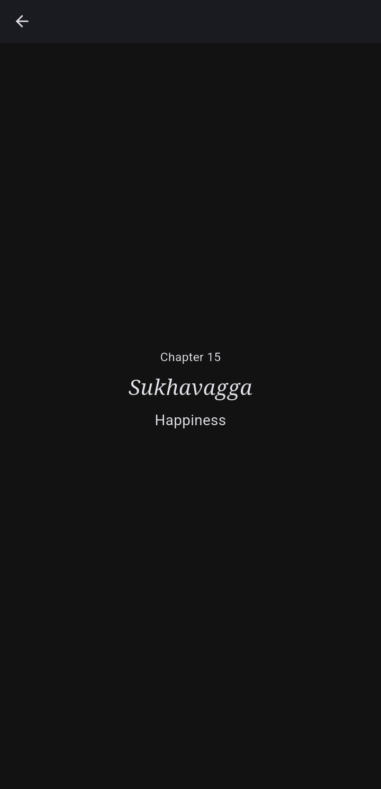
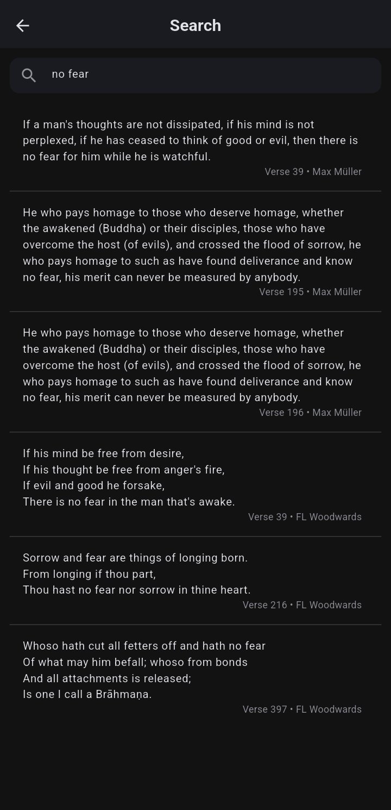
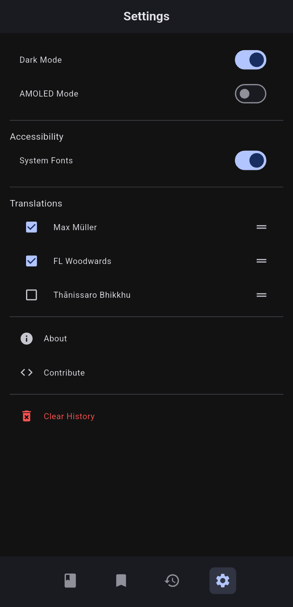

<h1>PocketDhamma</h1>

PocketDhamma is a lightweight, static mobile app built with Flutter for offline reading of the <i>Dhammapada</i>.

 

 
 

 

## Features

- **Offline Support**
  Access multiple translations of the Dhammapada without requiring an internet connection.

- **Comprehensive Search**
  Perform full-text searches across selected translations to locate specific verses efficiently.

- **Minimalist Interface**
  Focused on readability and clarity through a clean, distraction-free design.

- **Dynamic Theming**
  Implements Material 3 (Material You) principles, including adaptive light and dark modes.

- **System-Integrated Styling**
  Applies dynamic color theming for seamless integration with system-level aesthetics.

- **Cross-Platform Compatibility**
  Built for consistent performance and appearance on both Android and iOS platforms.

## Screenshots

  
  
  
  
  
  
  

## Installation

You can install PocketDhamma by downloading the latest APK from the [Releases](https://github.com/s4nj1th/pocket-dhamma/releases) section, or by getting it via the [IzzyOnDroid repository](https://apt.izzysoft.de/packages/com.s4nj1th.pocket_dhamma) on F-Droid.

Soon to be published on the Google Play Store.

## License

**PocketDhamma** is licensed under the [GPLv3](https://www.gnu.org/licenses/gpl-3.0.en.html).
Translations used have separate licenses—see `assets/translations/README.md` for details.

## Support

For questions or feedback, reach out to me:

- Email: sanjith.develops@gmail.com
- Twitter (X): [@s4nj1th](https://x.com/s4nj1th)
- BlueSky: [@s4nj1th.bsky.social](https://bsky.app/profile/s4nj1th.bsky.social)
